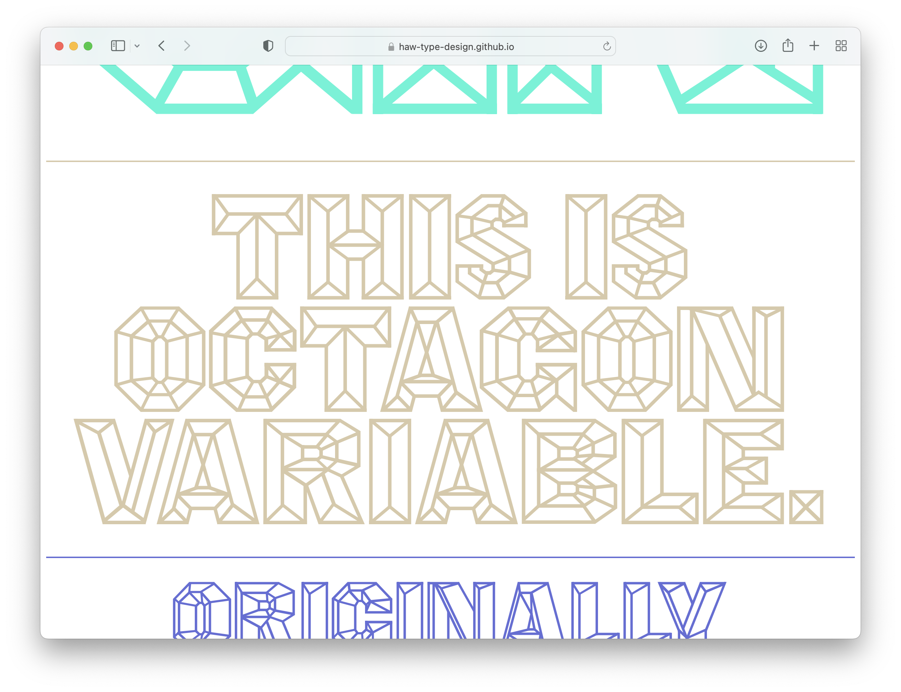

# Octagon Variable
This is the repository of the educational type design project *Octagon Variable* developed at the HAW Hamburg in 2022.

## Information
Based on *Octagon* – a wood type first shown in George Nesbitt’s *First Premium Wood Types Cut by Machinery* in 1838 – *Octagon Variable* is a reimagination of the original design by Edwin Allen as variable font in which the already present spatial illusions are pushed further. It was collaboratively redrawn with students at the design department of the Hochschule für Angewandte Wissenschaften Hamburg in 2022 as part of a first year type design introduction class under the guidance of Prof. Pierre Pané-Farré and Simon Thiefes.

*The original printing blocks held at the Rob Roy Kelly Collection measure 8 line in size and were produced with the end-cut method.* (Photo: ©David Shields)

## Participating students
Alexander Royter, Emma Schmalisch, Felix Willnauer, Friederike Temme, Greta Wachholz, Jason Tsiakas, Julia Baskal, Julia Schmidt, Kaja Wetzel, Kateryna Shelevytska, Lara Tamminga, Nina Vierke Liyani, Sania Salem, Sarah-Ann Röhlen, Sofiya Slyusarenko, Stina Scholz, Vanessa Schneider, Zoe Rygus with contributions by Pierre Pané-Farré and Simon Thiefes.

## Specimen (Web)
See and try *Octagon Variable* online at https://haw-type-design.github.io/octagon-variable/

## Specimen (Print)
On the occasion of its release a limited 16-page printed specimen showcasing *Octagon Variable* has been designed and printed on newsprint. Please [get in touch](mailto:pierre.pane-farre@dmi-haw-hamburg.de?subject=Octagon-Variable-Printed-Specimen&) for availability!

## References
* Kelly, Rob Roy: *American Wood Type 1828–1900. Notes on the evolution of Decorated and Large Types*, Liber Apertus Press, 2010.
* Shields, David: *George F. Nesbitt*, 2014. http://www.woodtyperesearch.com/george-nesbitt/
* Shields, David: *The Rob Roy Kelly American Wood Type Collection: a history and catalog.* Austin, University of Texas Press, 2022, p. 230-231.
* The Rob Roy Kelly Collection at *The Department of Art and Art History at The University of Texas at Austin* https://rrk.finearts.utexas.edu/?dt_portfolio=octagon
* Original mechanicals by Rob Roy Kelly of *Octagon* as shown on page 297 of *American Wood Type* https://www.flickr.com/photos/hithro/7753044048/in/album-72157631002519134/
* Andy Clymer’s *Tilt Typeface* https://github.com/andyclymer/Tilt-Typeface

## License
*Octagon Variable* is made available under the [Open Font License](http://scripts.sil.org/cms/scripts/page.php?site_id=nrsi&id=OFL). See LICENSE.txt for licensing information.

## Acknowledgements
We are particularly grateful to David Shields & Nick Sherman, who provided photographic imagery of  original specimen pages and the surviving wood type of *Octagon*.